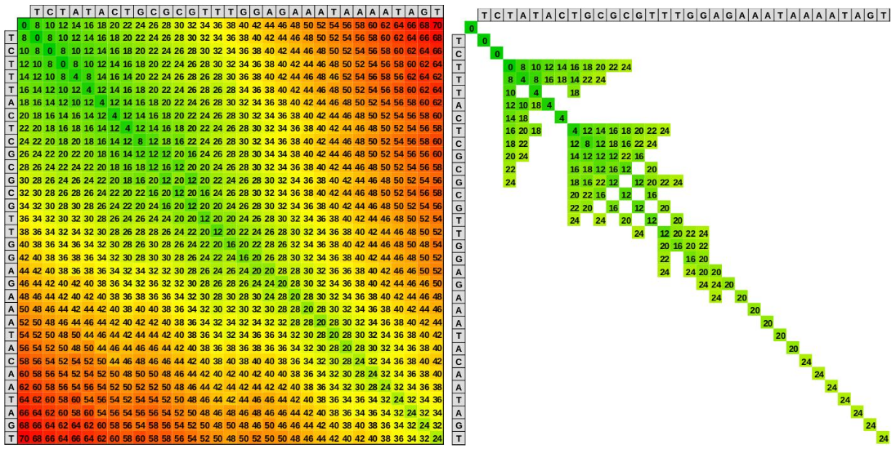
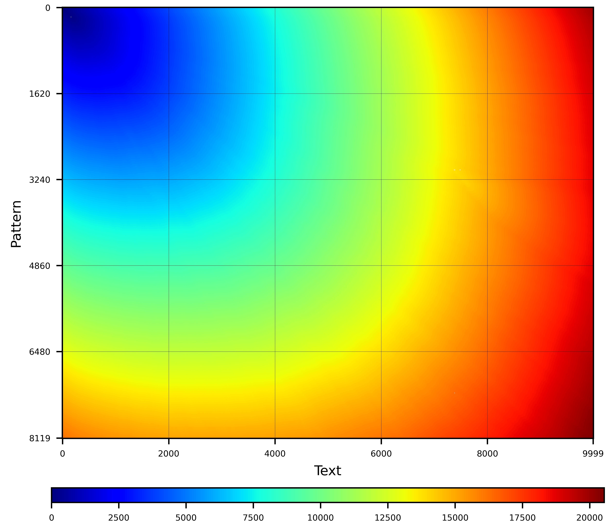
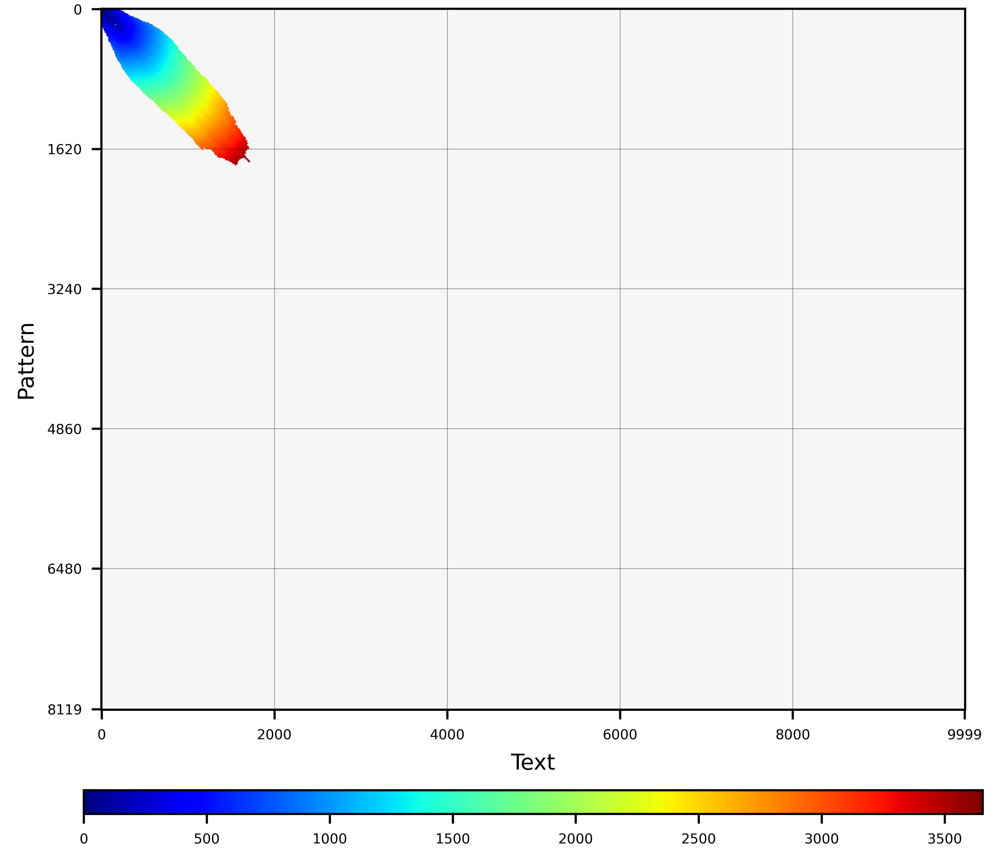
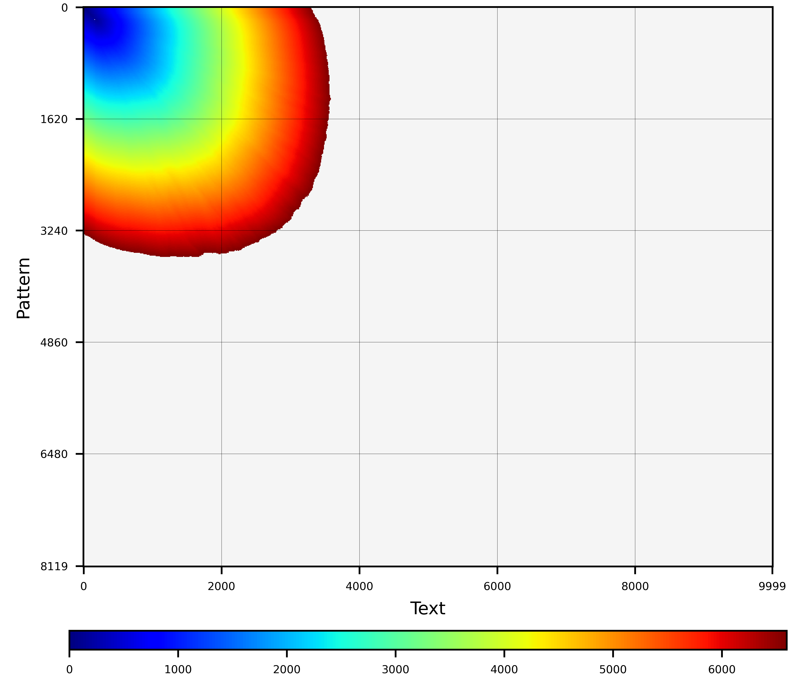
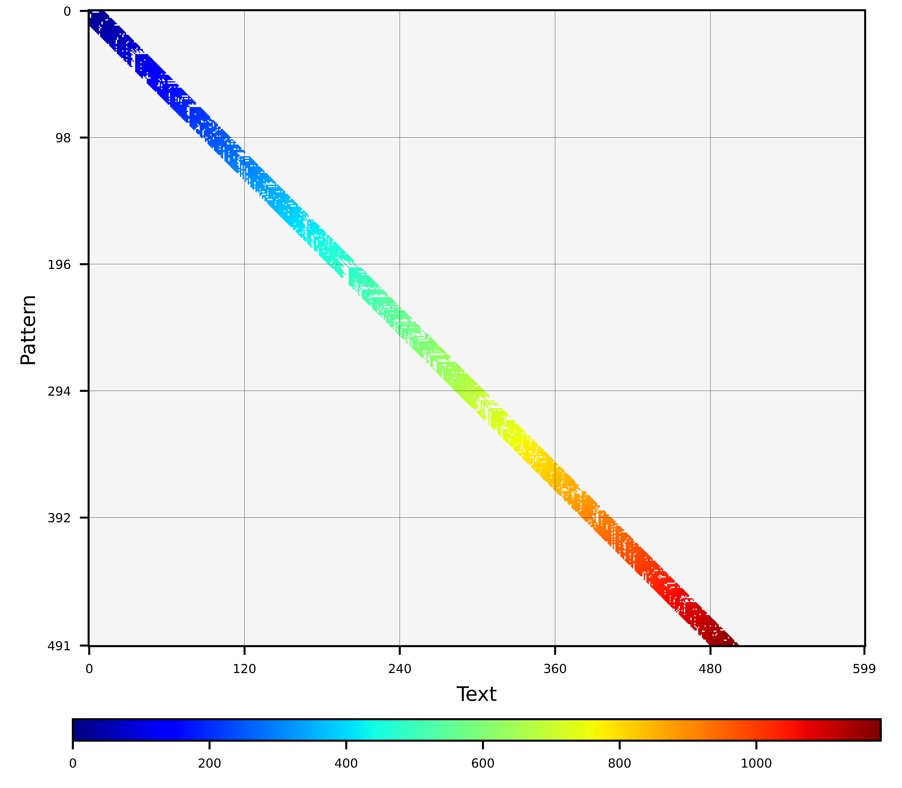

# WFA2-lib

## 1. INTRODUCTION

### 1.1 What is WFA?

The wavefront alignment (WFA) algorithm is an **exact** gap-affine algorithm that takes advantage of homologous regions between the sequences to accelerate the alignment process. Unlike to traditional dynamic programming algorithms that run in quadratic time, the WFA runs in time `O(ns+s^2)`, proportional to the sequence length `n` and the alignment score `s`, using `O(s^2)` memory (or `O(s)` using the ultralow/BiWFA mode). Moreover, the WFA algorithm exhibits simple computational patterns that the modern compilers can automatically vectorize for different architectures without adapting the code. To intuitively illustrate why the WFA algorithm is so interesting, look at the following figure. The left panel shows the cells computed by a classical dynamic programming based algorithm (like Smith-Waterman or Needleman Wunsch). In contrast, the right panel shows the cells computed by the WFA algorithm to obtain the same result (i.e., the optimal alignment).

<p align = "center">

</p>

### 1.2 What is WFA2-lib?

The WFA2 library implements the WFA algorithm for different distance metrics and alignment modes. It supports various [distance functions](#wfa2.distances): indel, edit, gap-lineal, gap-affine, and dual-gap gap-affine distances. The library allows computing only the score or the complete alignment (i.e., CIGAR) (see [Alignment Scope](#wfa2.scope)). Also, the WFA2 library supports computing end-to-end alignments (a.k.a. global-alignment) and ends-free alignments (including semi-global, glocal, and extension alignment) (see [Alignment Span](#wfa2.span)). In the case of long and noisy alignments, the library provides different [low-memory modes](#wfa2.mem) that significantly reduce the memory usage of the naive WFA algorithm implementation. Beyond the exact-alignment modes, the WFA2 library implements [heuristic modes](#wfa2.heuristics) that dramatically accelerate the alignment computation. Additionally, the library provides many other support functions to display and verify alignment results, control the overall memory usage, and more.

### 1.3 Getting started

Git clone and compile the library, tools, and examples. By default use cmake:

```
git clone https://github.com/smarco/WFA2-lib
cd WFA2-lib
mkdir build
cmake .. -DCMAKE_BUILD_TYPE=Release
cmake --build . --verbose
ctest . --verbose
```

There are some flags that can be used:

```
cmake .. -DOPENMP=TRUE
```

To add vector optimization try

```
cmake .. -DCMAKE_BUILD_TYPE=Release -DEXTRA_FLAGS="-ftree-vectorize -msse2 -mfpmath=sse -ftree-vectorizer-verbose=5"
```

To build a shared library (static is the default)

```
cmake -DBUILD_SHARED_LIBS=ON
```

It is possible to build WFA2-lib in a GNU Guix container, for more information see [guix.scm](./guix.scm).

### 1.4 Contents (where to go from here)

Section [WFA2-lib features](#wfa2.features) explores the most relevant options and features of the library. Then, the folder [tools/](tools/README.md) contains tools that can be used to execute and understand the WFA2 library capabilities. Additionally, the folder [examples/](examples/README.md) contains simple examples illustrating how to integrate the WFA2 code into any tool.

* [Using WFA2-lib in your project](#wfa2.programming)
    * [Simple C example](#wfa2.programming.c)
    * [Simple C++ example](#wfa2.programming.cpp)
* [WFA2-lib Features](#wfa2.features)
    * [Distance Metrics](#wfa2.distances)
    * [Alignment Scope](#wfa2.scope)
    * [Alignment Span](#wfa2.span)
    * [Memory modes](#wfa2.mem)
    * [Heuristic modes](#wfa2.heuristics)
    * [Technical notes](#wfa2.other.notes)
* [Reporting Bugs and Feature Request](#wfa2.complains)
* [License](#wfa2.licence)
* [Citation](#wfa2.cite)

### 1.5 Important notes and clarifications

- The WFA algorithm is an **exact algorithm**. If no heuristic is applied (e.g., band or adaptive pruning), the core algorithm guarantees to always find the optimal solution (i.e., best alignment score). Since its first release, some authors have referenced the WFA as approximated or heuristic, which is NOT the case.


- Given two sequences of length `n`, traditional dynamic-programming (DP) based methods (like Smith-Waterman or Needleman-Wunsch) compute the optimal alignment in `O(n^2)` time, using `O(n^2)` memory. In contrast, the WFA algorithm requires `O(ns+s^2)` time and `O(s^2)` memory (being `s` the optimal alignment score). Therefore, **the memory consumption of the WFA algorithm is not intrinsically higher than that of other methods**. Most DP-based methods can use heuristics (like banded, X-drop, or Z-drop) to reduce the execution time and the memory usage at the expense of losing accuracy. Likewise, **the WFA algorithm can also use heuristics to reduce the execution time and memory usage**. Moreover, the memory mode `ultralow` uses the BiWFA algorithm to execute in `O(ns+s^2)` time and linear `O(s)` memory.


- **A note for the fierce competitors.** I can understand that science and publishing have become a fierce competition these days. Many researchers want their methods to be successful and popular, seeking funding, tenure, or even fame. If you are going to benchmark the WFA using the least favourable configuration, careless programming, and a disadvantageous setup, please, go ahead. But remember, researchers like you have put a lot of effort into developing the WFA. We all joined this "competition" because we sought to find better methods that could truly help other researchers. So, try to be nice, tone down the marketing, and produce fair evaluations and honest publications.

## <a name="wfa2.programming"></a> 2. USING WFA2-LIB IN YOUR PROJECT

### <a name="wfa2.programming.c"></a> 2.1 Simple C example

This simple example illustrates how to align two sequences using the WFA2 library. First, include the WFA2 alignment headers.

```C
#include "wavefront/wavefront_align.h"
```

Next, create and configure the WFA alignment object. The following example uses the defaults configuration and sets custom `gap_affine` penalties. Note that mismatch, gap-opening, and gap-extension must be positive values.

```C
// Configure alignment attributes
wavefront_aligner_attr_t attributes = wavefront_aligner_attr_default;
attributes.distance_metric = gap_affine;
attributes.affine_penalties.mismatch = 4;
attributes.affine_penalties.gap_opening = 6;
attributes.affine_penalties.gap_extension = 2;
// Initialize Wavefront Aligner
wavefront_aligner_t* const wf_aligner = wavefront_aligner_new(&attributes);
```

Finally, call the `wavefront_align` function.

```C
char* pattern = "TCTTTACTCGCGCGTTGGAGAAATACAATAGT";
char* text    = "TCTATACTGCGCGTTTGGAGAAATAAAATAGT";
wavefront_align(wf_aligner,pattern,strlen(pattern),text,strlen(text)); // Align
```

Afterwards, we can use the library to display the alignment result (e.g., the alignment score and CIGAR).

```C
// Display CIGAR & score
cigar_print_pretty(stderr,pattern,strlen(pattern),text,strlen(text),
                   &wf_aligner->cigar,wf_aligner->mm_allocator);
fprintf(stderr,"Alignment Score %d\n",wf_aligner->cigar.score);
```

At the end of the program, it is polite to release the memory used.

```C
wavefront_aligner_delete(wf_aligner); // Free
```

To compile and run this example, you need to link against the WFA library (-lwfa).

```
$> gcc -O3 wfa_example.c -o wfa_example -lwfa
$> ./wfa_example
```

**IMPORTANT.** Once an alignment object is created, **it is strongly recommended to reuse it to compute multiple alignments**. Creating and destroying the alignment object for every alignment computed can have a significant overhead. Reusing the alignment object allows repurposing internal data structures, minimising the cost of memory allocations, and avoiding multiple alignment setups and precomputations.

### <a name="wfa2.programming.cpp"></a> 2.2 Simple C++ example

The WFA2 library can be used from C++ code using the C++ bindings. This example is similar to the previous one but uses C++ bindings. First, include the C++ bindings and remember to use the WFA namespace.

```C
#include "bindings/cpp/WFAligner.hpp"
using namespace wfa;
```

Configure and create the WFA alignment object. In this case, gap-affine distance using custom penalties and the standard memory-usage algorithm (i.e., standard WFA algorithm).

```C++
// Create a WFAligner
WFAlignerGapAffine aligner(4,6,2,WFAligner::Alignment,WFAligner::MemoryHigh);
```

Align two sequences (in this case, given as strings).

```C++
string pattern = "TCTTTACTCGCGCGTTGGAGAAATACAATAGT";
string text    = "TCTATACTGCGCGTTTGGAGAAATAAAATAGT";
aligner.alignEnd2End(pattern,text); // Align
```

Display the result of the alignment.

```C++
// Display CIGAR & score
string cigar = aligner.getAlignmentCigar();
cout << "CIGAR: " << cigar  << endl;
cout << "Alignment score " << aligner.getAlignmentScore() << endl;
```

**IMPORTANT.** Once an alignment object is created, **it is strongly recommended to reuse it to compute multiple alignments**. Creating and destroying the alignment object for every alignment computed can have a significant overhead. Reusing the alignment object allows repurposing internal data structures, minimising the cost of memory allocations, and avoiding multiple alignment setups and precomputations.

### <a name="wfa2.programming.rust"></a> 2.3 Rust bindings

Rust bindings can be generated automatically using `bindgen`, see [bindings/rust/build.rs](bindings/rust/build.rs).
An example of how to use them is [here](./bindings/rust/example.rs).

## <a name="wfa2.features"></a> 3. WFA2-LIB FEATURES

* **Exact alignment** method that computes the optimal **alignment score** and/or **alignment CIGAR**.
* Supports **multiple distance metrics** (i.e., indel, edit, gap-lineal, gap-affine, and dual-gap gap-affine).
* Allows performing **end-to-end** (a.k.a. global) and **ends-free** (e.g., semi-global, extension, overlap) alignment.
* Implements **low-memory modes** to reduce and control memory consumption (down to `O(s)` using the `ultralow` mode).
* Supports various **heuristic strategies** to use on top of the core WFA algorithm.
* WFA2-lib **operates with plain ASCII strings**. Although we mainly focus on aligning DNA/RNA sequences, the WFA algorithm and the WFA2-lib implementation work with any pair of strings. Moreover, these sequences do not have to be pre-processed (e.g., packed or profiled), nor any table must be precomputed (like the query profile, used within some Smith-Waterman implementations).
* Due to its simplicity, the WFA algorithm can be automatically vectorized for any SIMD-compliant CPU supported by the compiler. For this reason, **the WFA2-lib implementation is independent of any specific ISA or processor model**. Unlike other hardware-dependent libraries, we aim to offer a multiplatform pairwise-alignment library that can be executed on different processors and models (e.g., SSE, AVX2, AVX512, POWER-ISA, ARM, NEON, SVE, SVE2, RISCV-RVV, ...).

### <a name="wfa2.distances"></a> 3.1 Distance Metrics

The WFA2 library implements the wavefront algorithm for the most widely used distance metrics. The practical alignment time can change depending on the distance function, although the computational complexity always remains proportional to the alignment score or distance. The WFA2 library offers the following distance metrics or functions:

- **Indel (or LCS).** Produces alignments allowing matches, insertions, and deletions with unitary cost (i.e., {M,I,D} = {0,1,1}) but not mismatches. Also known as the longest common subsequence (LCS) problem. The LCS is defined as the longest subsequence common to both sequences, provided that the characters of the subsequence are not required to occupy consecutive positions within the original sequences.

```
    PATTERN    A-GCTA-GTGTC--AATGGCTACT-T-T-TCAGGTCCT
               |  ||| |||||    |||||||| | | |||||||||
    TEXT       AA-CTAAGTGTCGG--TGGCTACTATATATCAGGTCCT
    ALIGNMENT  1M1I1D3M1I5M2I2D8M1I1M1I1M1I9M
```

```C
    // Configuration
    wavefront_aligner_attr_t attributes = wavefront_aligner_attr_default;
    attributes.distance_metric = indel;
```

- **Edit (a.k.a. Levenshtein).** Produces alignments allowing matches, mismatches, insertions, and deletions with unitary cost (i.e., {M,X,I,D} = {0,1,1,1}). Edit or Levenshtein distance between two sequences is the minimum number of single-character edits (i.e., insertions, deletions, or mismatches) required to transform one sequence into the other.

```
    PATTERN    AGCTA-GTGTCAATGGCTACT-T-T-TCAGGTCCT
               | ||| |||||  |||||||| | | |||||||||
    TEXT       AACTAAGTGTCGGTGGCTACTATATATCAGGTCCT
    ALIGNMENT  1M1X3M1I5M2X8M1I1M1I1M1I9M
```

```C
    // Configuration
    wavefront_aligner_attr_t attributes = wavefront_aligner_attr_default;
    attributes.distance_metric = edit;
```

- **Gap-linear (as in Needleman-Wunsch).** Produces alignments allowing matches, mismatches, insertions, and deletions. Allows assigning a penalty (a.k.a. cost or weight) to each alignment operation. It computes the optimal alignment, minimizing the overall cost to transform one sequence into the other. Under the gap-linear model, the alignment score is computed based on {X,I}⁠, where X corresponds to the mismatch penalty and the gap penalty is expressed as the function l(N)=N·I (given the length of the gap N and the gap penalty I).

```
    PATTERN    A-GCTA-GTGTC--AATGGCTACT-T-T-TCAGGTCCT
               |  ||| |||||    |||||||| | | |||||||||
    TEXT       AA-CTAAGTGTCGG--TGGCTACTATATATCAGGTCCT
    ALIGNMENT  1M1I1D3M1I5M2I2D8M1I1M1I1M1I9M
```

```C
    // Configuration
    wavefront_aligner_attr_t attributes = wavefront_aligner_attr_default;
    attributes.distance_metric = gap_linear;
    attributes.linear_penalties.mismatch = 6; // X > 0
    attributes.linear_penalties.indel = 2;    // I > 0
```

- **Gap-affine (as in Smith-Waterman-Gotoh).** Linear gap cost functions can lead to alignments populated with small gaps. Long gaps are preferred in certain scenarios, like genomics or evolutionary studies (understood as a single event). Under the gap-affine model, the alignment score is computed based on {X,O,E}⁠, where X corresponds to the mismatch penalty and the gap penalty is expressed as the function g(N)=O+N·E (given the length of the gap N, the gap opening penalty O, and the gap extension penalty E).

```
    PATTERN    AGCTA-GTGTCAATGGCTACT---TTTCAGGTCCT
               | ||| |||||  ||||||||   | |||||||||
    TEXT       AACTAAGTGTCGGTGGCTACTATATATCAGGTCCT
    ALIGNMENT  1M1X3M1I5M2X8M3I1M1X9M
```

```C
    // Configuration
    wavefront_aligner_attr_t attributes = wavefront_aligner_attr_default;
    attributes.distance_metric = gap_affine;
    attributes.affine_penalties.mismatch = 6;      // X > 0
    attributes.affine_penalties.gap_opening = 4;   // O >= 0
    attributes.affine_penalties.gap_extension = 2; // E > 0
```

- **Dual-cost gap-affine distances.** Also known as piece-wise gap-affine cost, this distance metric addresses some issues that the regular gap-affine distance has with long gaps. In a nutshell, the regular gap-affine distance can occasionally split long gaps by sporadic mismatches (often when aligning long and noisy sequences). Instead, many users would prefer to increase the open gap cost to produce a single long gap. For that, the dual-cost gap-affine distance (p=2) defines two affine cost functions (i.e., for short and long gaps). Then, the alignment score is computed based on {X,O1,E1,O2,E2}⁠, where X corresponds to the mismatch penalty and the gap penalty is expressed as the function g(N)=min{O1+N·E1,O2+N·E2} (given the length of the gap N, the gap opening penalties O1 and O2, and the gap extension penalties E1 and E2).

```C
    wavefront_aligner_attr_t attributes = wavefront_aligner_attr_default;
    attributes.distance_metric = gap_affine_2p;
    attributes.affine2p_penalties.mismatch = 6;       // X > 0
    attributes.affine2p_penalties.gap_opening1 = 4;   // O1 >= 0
    attributes.affine2p_penalties.gap_extension1 = 2; // E1 > 0
    attributes.affine2p_penalties.gap_opening2 = 12;  // O2 >= 0
    attributes.affine2p_penalties.gap_extension2 = 1; // E2 > 0
```

### <a name="wfa2.scope"></a> 3.2 Alignment Scope

Depending on the use case, it is often the case that an application is only required to compute the alignment score, not the complete alignment (i.e., CIGAR). As it happens with traditional dynamic programming algorithms, the WFA algorithm requires less memory (i.e., `O(s)`) to compute the alignment score. In turn, this results in slighter faster alignment executions. For this reason, the WFA2 library implements two different modes depending on the alignment scope: score-only and full-CIGAR alignment.

The ** score-only alignment ** mode computes only the alignment score. This mode utilizes only the front-wavefronts of the WFA algorithm to keep track of the optimal alignment score. As a result, it requires `O(s)` memory and, in practice, performs slighter faster than the standard full-CIGAR mode.

```C
    wavefront_aligner_attr_t attributes = wavefront_aligner_attr_default;
    attributes.alignment_scope = compute_score;
```

The ** full-CIGAR alignment ** computes the sequence of alignment operations (i.e., {'M','X','D','I'}) that transforms one sequence into the other (i.e., alignment CIGAR). The alignment score can be obtained as a by-product of the alignment process, evaluating the score of the alignment CIGAR. This mode requires `O(s^2)` memory (using the default memory mode, wavefront_memory_high) or less (using the low-memory modes).


```C
    wavefront_aligner_attr_t attributes = wavefront_aligner_attr_default;
    attributes.alignment_scope = compute_alignment;
```

### <a name="wfa2.span"></a> 3.3 Alignment Span

The WFA2 library allows computing alignments with different spans or shapes. Although there is certain ambiguity and confusion in the terminology, we have tried to generalize the different options available to offer flexible parameters that can capture multiple alignment scenarios. During the development of the WFA we decided to adhere to the classical approximate string matching terminology where we align a **pattern (a.k.a. query or sequence)** against a **text (a.k.a. target, database, or reference)**.

- **End-to-end alignment.** Also known as global alignment, this alignment mode forces aligning the two sequences from the beginning to end of both.

```
    PATTERN    AATTAATTTAAGTCTAGGCTACTTTCGGTACTTTGTTCTT
               ||||    ||||||||||||||||||||||||||   |||
    TEXT       AATT----TAAGTCTAGGCTACTTTCGGTACTTT---CTT
```

```C
    wavefront_aligner_attr_t attributes = wavefront_aligner_attr_default;
    attributes.alignment_form.span = alignment_end2end;
```

- **Ends-free alignment.** This alignment mode allows leading and trailing insertions or deletions for "free" (i.e., no penalty/cost on the overall alignment score). Moreover, this alignment mode allows determining the maximum gap length allowed for free at the beginning and end of the sequences. Note that this mode does not implement local alignment as it does not allow free insertions and deletions at the beginning/end of the sequences at the same time. However, it allows many different configurations used across different analyses, methods, and tools.

```
    PATTERN    AATTAATTTAAGTCTAGGCTACTTTCGGTACTTTGTTCTT
                   |||||||||||||||||||||||||||||| ||
    TEXT       ----AATTTAAGTCTAGGCTACTTTCGGTACTTTCTT---
```

```C
    wavefront_aligner_attr_t attributes = wavefront_aligner_attr_default;
    attributes.alignment_form.span = alignment_endsfree;
    attributes.alignment_form.pattern_begin_free = pattern_begin_free;
    attributes.alignment_form.pattern_end_free = pattern_end_free;
    attributes.alignment_form.text_begin_free = text_begin_free;
    attributes.alignment_form.text_end_free = text_end_free;
```

- **Other**

<details><summary>Glocal alignment (a.k.a. semi-global or fitting)</summary>
<p>

- **Glocal alignment (a.k.a. semi-global or fitting).** Alignment mode where the pattern is globally aligned and the text is locally aligned. Often due to the large size of one of the sequences (e.g., the text sequence being a genomic reference), this alignment mode forces one sequence (i.e., pattern) to align globally to a substring of the other (i.e., text).

```
    PATTERN    -------------AATTTAAGTCTAGGCTACTTTC---------------
                            ||||||||| ||||||||||||
    TEXT       ACGACTACTACGAAATTTAAGTATAGGCTACTTTCCGTACGTACGTACGT
```

```C
    wavefront_aligner_attr_t attributes = wavefront_aligner_attr_default;
    attributes.alignment_form.span = alignment_endsfree;
    attributes.alignment_form.pattern_begin_free = 0;
    attributes.alignment_form.pattern_end_free = 0;
    attributes.alignment_form.text_begin_free = text_begin_free;
    attributes.alignment_form.text_end_free = text_end_free;
```

</p>
</details>

<details><summary>Extension alignment</summary>
<p>

- **Extension alignment.** Alignment mode where the start of both pattern and text sequences are forced to be aligned. However, the ends of both are free. This alignment mode is typically used within seed-and-extend algorithms.

```C
    // Right extension
    wavefront_aligner_attr_t attributes = wavefront_aligner_attr_default;
    attributes.alignment_form.span = alignment_endsfree;
    attributes.alignment_form.pattern_begin_free = 0;
    attributes.alignment_form.pattern_end_free = pattern_end_free;
    attributes.alignment_form.text_begin_free = 0;
    attributes.alignment_form.text_end_free = text_end_free;

    PATTERN    AATTTAAGTCTG-CTACTTTCACGCA-GCT----------
               ||||| |||||| ||||||||||| | | |
    TEXT       AATTTCAGTCTGGCTACTTTCACGTACGATGACAGACTCT
```

```C
    // Left extension
    wavefront_aligner_attr_t attributes = wavefront_aligner_attr_default;
    attributes.alignment_form.span = alignment_endsfree;
    attributes.alignment_form.pattern_begin_free = pattern_begin_free;
    attributes.alignment_form.pattern_end_free = 0;
    attributes.alignment_form.text_begin_free = text_begin_free;
    attributes.alignment_form.text_end_free = 0;

    PATTERN    -------------AAACTTTCACGTACG-TGACAGTCTCT
                              ||||||||||||| |||||| ||||
    TEXT       AATTTCAGTCTGGCTACTTTCACGTACGATGACAGACTCT
```

</p>
</details>

<details><summary>Overlapped alignment</summary>
<p>

- **Overlapped alignment (a.k.a. dovetail).**

```C
    // Overlapped (Right-Left)
    wavefront_aligner_attr_t attributes = wavefront_aligner_attr_default;
    attributes.alignment_form.span = alignment_endsfree;
    attributes.alignment_form.pattern_begin_free = pattern_begin_free;
    attributes.alignment_form.pattern_end_free = 0;
    attributes.alignment_form.text_begin_free = 0;
    attributes.alignment_form.text_end_free = text_end_free;

    PATTERN    ACGCGTCTGACTGACTGACTAAACTTTCATGTAC-TGACA-----------------
                                   ||||||||| |||| |||||
    TEXT       --------------------AAACTTTCACGTACGTGACATATAGCGATCGATGACT
```

```C
    // Overlapped (Left-Right)
    wavefront_aligner_attr_t attributes = wavefront_aligner_attr_default;
    attributes.alignment_form.span = alignment_endsfree;
    attributes.alignment_form.pattern_begin_free = 0;
    attributes.alignment_form.pattern_end_free = pattern_end_free;
    attributes.alignment_form.text_begin_free = text_begin_free;
    attributes.alignment_form.text_end_free = 0;

    PATTERN    ----------------------ACGCGTCTGACTGACTACGACTACGACTGACTAGCAT
                                     ||||||||| || ||
    TEXT       ACATGCATCGATCAGACTGACTACGCGTCTG-CTAAC----------------------
```

</p>
</details>

### <a name="wfa2.mem"></a> 3.4 Memory modes

The WFA2 library implements various memory modes: `wavefront_memory_high`, `wavefront_memory_med`, `wavefront_memory_low`, and , `wavefront_memory_ultralow`. These modes allow regulating the overall memory consumption at the expense of execution time. The standard WFA algorithm, which stores explicitly all wavefronts in memory, correspond to the mode `wavefront_memory_high`. The other methods progressively reduce memory usage at the expense of slightly larger alignment times. These memory modes can be used transparently with other alignment options and generate identical results. Note that this option does not affect the score-only alignment mode (it already uses a minimal memory footprint of `O(s)`).

```C
  wavefront_aligner_attr_t attributes = wavefront_aligner_attr_default;
  attributes.memory_mode = wavefront_memory_med;
```

### <a name="wfa2.heuristics"></a> 3.5 Heuristic modes

The WFA algorithm can be used combined with many heuristics to reduce the alignment time and memory used. As it happens to other alignment methods, heuristics can result in suboptimal solutions and loss of accuracy. Moreover, some heuristics may drop the alignment if the sequences exceed certain divergence thresholds (i.e., x-drop/z-drop). Due to the popularity and efficiency of these methods, the WFA2 library implements many of these heuristics. Note, **it is not about how little DP-matrix you compute, but about how good/accurate the resulting alignments are.**

WFA2's heuristics are classified into the following categories: ['wf-adaptive'](#wfa2.wfadaptive), ['drops'](#wfa2.drops), and ['bands'](#wfa2.bands). It is possible to combine a maximum of one heuristic from each category (OR-ing the strategy values or using the API). In the case of using multiple heuristics, these will applied in cascade, starting with 'wf-adaptive', then 'drops', and finally 'bands'.

- **None (for comparison)**. If no heuristic is used, the WFA behaves exploring cells of the DP-matrix in increasing score order (increasing scores correspond to colours from blue to red).

<p align="center">
<table>
  <tr>
    <td><p align="center">Full-WFA</p></td>
  </tr>
  <tr>
    <td></td>
  </tr>
</table>
</p>

```C
  wavefront_aligner_attr_t attributes = wavefront_aligner_attr_default;
  attributes.heuristic.strategy = wf_heuristic_none;
```

- <a name="wfa2.wfadaptive"></a> **Heuristic wf-adaptive.** This WFA heuristic removes outer diagonals that are extremely far behind compared to other ones in the same wavefront. Unlike other methods, the adaptive-wavefront reduction heuristic prunes based on the potential of the diagonal to lead to the optimal solution without previous knowledge of the error between the sequences.

```C
  wavefront_aligner_attr_t attributes = wavefront_aligner_attr_default;
  attributes.heuristic.strategy = wf_heuristic_wfadaptive;
  attributes.heuristic.min_wavefront_length = 10;
  attributes.heuristic.max_distance_threshold = 50;
  attributes.heuristic.steps_between_cutoffs = 1;
```

&nbsp;&nbsp;&nbsp;&nbsp;&nbsp;&nbsp;&nbsp;&nbsp;**Graphical examples:**

<p align="center">
<table>
  <tr>
    <td><p align="center">Adaptive-WF(10,50)</p></td>
    <td><p align="center">Adaptive-WF(10,50,10)</p></td>
  </tr>
  <tr>
    <td></td>
    <td></td>
  </tr>
</table>
</p>

- <a name="wfa2.drops"></a> **Heuristic drops.** This heuristic compares the maximum score computed so far with the score of the last computed cells. Depending on the score difference, these heuristic strategies can reduce the size of the wavefront computed or even abandon the alignment process. In the case of zero-match alignment, $M=1$ will be assumed just for computation of the score drop. Also note that this heuristic is not compatible with distances 'edit' or 'indel'. In this category, WFA2 implements 'X-drop' and 'Z-drop'.

&nbsp;&nbsp;&nbsp;&nbsp;&nbsp;&nbsp;&nbsp;&nbsp;**X-drop** implements the classical X-drop heuristic. For each diagonal $k$, the X-drop heuristic compares the current score $sw_k$ with the maximum observed score so far $sw_{max}$. If the difference drops more than the $xdrop$ parameter (i.e., $sw_{max} - sw_k > xdrop$), the heuristic prunes the diagonal $k$ as it is unlikely to lead to the optimum alignment. If all the diagonals are pruned under this criteria, the alignment process is abandoned.

```C
  wavefront_aligner_attr_t attributes = wavefront_aligner_attr_default;
  attributes.heuristic.strategy = wf_heuristic_xdrop;
  attributes.heuristic.xdrop = 100;
  attributes.heuristic.steps_between_cutoffs = 100;
```

&nbsp;&nbsp;&nbsp;&nbsp;&nbsp;&nbsp;&nbsp;&nbsp;**Z-drop** implements the Z-drop heuristic (as described in Minimap2). This heuristic halts the alignment process if the score drops too fast in the diagonal direction. Let $sw_{max}$ be the maximum observed score so far, computed at cell $(i',j')$. Then, let $sw$ be the maximum score found in the last computed wavefront, computed at cell $(i,j)$. The Z-drop heuristic stops the alignment process if $sw_{max} - sw > zdrop + gap_e·|(i-i')-(j-j')|$, being $gap_e$ the gap-extension penalty and $zdrop$ a parameter of the heuristic.


```C
  wavefront_aligner_attr_t attributes = wavefront_aligner_attr_default;
  attributes.heuristic.strategy = wf_heuristic_zdrop;
  attributes.heuristic.zdrop = 100;
  attributes.heuristic.steps_between_cutoffs = 100;
```

&nbsp;&nbsp;&nbsp;&nbsp;&nbsp;&nbsp;&nbsp;&nbsp;**Graphical examples:**

<p align="center">
<table>
  <tr>
    <td><p align="center">None</p></td>
    <td><p align="center">X-drop(200,1)</p></td>
    <td><p align="center">Z-drop(200,1)</p></td>
  </tr>
  <tr>
    <td></td>
    <td></td>
    <td></td>
  </tr>
</table>
</p>


- <a name="wfa2.bands"></a> **Heuristic bands.** These heuristics set a band in the diagonals preventing the wavefront from growing beyond those limits. It allows setting the minimum diagonal (i.e., min_k) and maximum diagonal (i.e., max_k). These heuristics are the most restrictive but the fastest and simplest to compute. In this category, WFA2 implements 'static-band' and 'adaptive-band'.

&nbsp;&nbsp;&nbsp;&nbsp;&nbsp;&nbsp;&nbsp;&nbsp;**Static-band** sets a fixed band in the diagonals preventing the wavefront from growing beyond those limits. It allows setting the minimum diagonal (i.e., min_k) and maximum diagonal (i.e., max_k).

```C
  wavefront_aligner_attr_t attributes = wavefront_aligner_attr_default;
  attributes.heuristic.strategy = wf_heuristic_banded_static;
  attributes.heuristic.min_k = -10;
  attributes.heuristic.max_k = +10;
```

&nbsp;&nbsp;&nbsp;&nbsp;&nbsp;&nbsp;&nbsp;&nbsp;**Adaptive-band** is similar to the static-band heuristic; however, it allows the band to move towards the diagonals closer to the end of the alignment. Unlike the static-band that is performed on each step, the adaptive-band heuristics allows configuring the number of steps between heuristic band cut-offs.

```C
  wavefront_aligner_attr_t attributes = wavefront_aligner_attr_default;
  attributes.heuristic.strategy = wf_heuristic_banded_adaptive;
  attributes.heuristic.min_k = -10;
  attributes.heuristic.max_k = +10;
  attributes.heuristic.steps_between_cutoffs = 1;
```

&nbsp;&nbsp;&nbsp;&nbsp;&nbsp;&nbsp;&nbsp;&nbsp;**Graphical examples:**

<p align="center">
<table>
  <tr>
    <td><p align="center">Banded(10,10)</p></td>
    <td><p align="center">Banded(10,150)</p></td>
  </tr>
  <tr>
    <td></td>
    <td></td>
  </tr>
  <tr>
    <td><p align="center">Adaptive-Band(10,10,1)</p></td>
    <td><p align="center">Adaptive-Band(50,50,1)</p></td>
  </tr>
  <tr>
    <td></td>
    <td></td>
  </tr>
</table>
</p>


### <a name="wfa2.other.notes"></a> 3.6 Some technical notes

- Thanks to Eizenga's formulation, WFA2-lib can operate with any match score. Although, in practice, M=0 is still the most efficient choice.

- Note that edit and LCS are distance metrics and, thus, the score computed is always positive. However, weighted distances, like gap-linear and gap-affine, have the sign of the computed alignment evaluated under the selected penalties. If WFA2-lib is executed using $M=0$, the final score is expected to be negative.

- All WFA2-lib algorithms/variants are stable. That is, for alignments having the same score, the library always resolves ties (between M, X, I,and D) using the same criteria: M (highest prio) > X > D > I (lowest prio). Nevertheless, the memory mode `ultralow` (BiWFA) is optimal (always reports the best alignment) but not stable.

## <a name="wfa2.complains"></a> 4. REPORTING BUGS AND FEATURE REQUEST

Feedback and bug reporting is highly appreciated. Please report any issue or suggestion on github or email to the main developer (santiagomsola@gmail.com). Don't hesitate to contact us
if:
  - You experience any bug or crash.
  - You want to request a feature or have any suggestion.
  - Your application using the library is running slower than it should or you expected.
  - Need help integrating the library into your tool.

## <a name="wfa2.licence"></a> 5. LICENSE

WFA2-lib is distributed under MIT licence.

## <a name="wfa2.complains"></a> 6. AUTHORS

[Santiago Marco-Sola](https://github.com/smarco) (santiagomsola@gmail.com) is the main developer and the person you should address your complaints.

[Andrea Guarracino](https://github.com/AndreaGuarracino) and [Erik Garrison](https://github.com/ekg) have contributed to the design of new features and intensive testing of the library.

[Pjotr Prins](https://thebird.nl/) contributed the CMake build system, preventing of leaking variables in include headers and other tweaks.

Miquel Moretó has contributed with fruitful technical discussions and tireless efforts seeking funding, so we could keep working on this project.

## <a name="wfa2.complains"></a> 7. ACKNOWLEDGEMENTS

- Baoxing Song and Buckler's lab for their interest and help promoting the WFA and pushing for the inclusion of new features.

- Juan Carlos Moure and Antonio Espinosa for their collaboration and support of this project.

## <a name="wfa2.cite"></a> 8. CITATION

**Santiago Marco-Sola, Juan Carlos Moure, Miquel Moreto, Antonio Espinosa**. ["Fast gap-affine pairwise alignment using the wavefront algorithm."](https://doi.org/10.1093/bioinformatics/btaa777). Bioinformatics, 2020.

**Santiago Marco-Sola, Jordan M Eizenga, Andrea Guarracino, Benedict Paten, Erik Garrison, Miquel Moreto**. ["Optimal gap-affine alignment in O(s) space"](https://doi.org/10.1093/bioinformatics/btad074). Bioinformatics, 2023.
